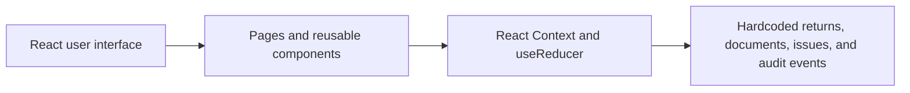
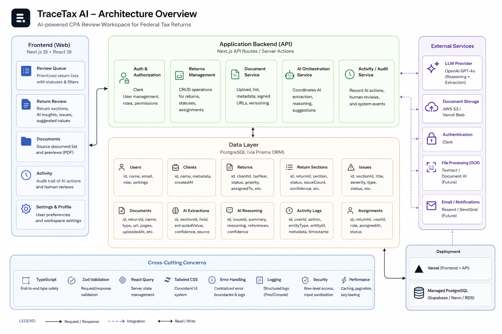

# TraceTax AI

TraceTax AI is a frontend prototype for CPA review of AI-extracted tax data. It focuses on source traceability, clear field affordances, and human oversight of AI recommendations so reviewers can understand the evidence behind a value and record an explicit decision.

## Challenges addressed

- **Challenge 01: Source Document Traceability** — Connects reviewed fields to the relevant mock document, page, highlighted region, extracted value, and transformation steps. Aggregated values show their contributing documents.
- **Challenge 04: Getting Lost Between Parts of the App** — Preserves return, section, field, evidence tab, document, activity event, and queue context in stable URLs with contextual breadcrumbs and back-navigation.
- **Challenge 06: Return Status & Progress** — Derives review progress, lifecycle status, blockers, ownership, and next actions from the current mock workflow state.
- **Challenge 08: Clickable vs. Editable** — Uses consistent status labels, icons, styling, and controls to distinguish selectable, editable, verified, read-only, locked, manually corrected, and exception states.
- **Challenge 10: Trustworthy AI** — Presents confidence as a label and percentage alongside supporting factors, reasoning, uncertainty, a recommended action, and a retained history of human decisions.

## Core workflow

1. Filter or search the review queue.
2. Open a tax return.
3. Select a section and inspect an AI-flagged field.
4. Review the exact source evidence and the transformation used to produce the suggestion.
5. Apply the suggestion, reject it by keeping the current value, or enter a replacement value.
6. Record the decision and rationale in the field history and global audit trail.

## Architecture

The implemented prototype is entirely client-side:



The following diagram shows a possible production evolution, not the implementation in this repository:



The depicted Next.js API layer, PostgreSQL database, authentication, document storage, OCR, LLM integration, notifications, and server-side audit services are not included in this case-study submission.

## What is functional

- Review-queue filters, client-name search, and empty states
- Return, section, and field navigation
- Context-preserving deep links, breadcrumbs, related-object links, and back-navigation
- Evidence summaries, supporting-document selection, highlighted source regions, and document zoom
- Confidence, reasoning, uncertainty, recommendation, and transformation-step presentation
- Applying an AI-suggested value or keeping the current value with a recorded rationale
- Manual value replacement with validation and retained AI-recommendation context
- Conflicting-source selection and missing-document request events
- Live workspace progress, open-issue counts, and field status updates
- Derived lifecycle stages, next-action ownership, blockers, waiting-on-client, and ready-to-file states
- Automatic mock recalculation of locked totals after component-field decisions
- Per-field history and a global audit trail retained for the active browser tab

## What is simulated

- OCR and document parsing; previews are stylized React-rendered documents rather than parsed PDFs
- AI extraction, recommendations, reasoning, and confidence scores; all are predefined
- Tax logic; the two demonstrated calculated fields use transparent, scripted mock formulas
- Authentication and authorization; the current reviewer is hardcoded
- Persistence; review state uses browser `sessionStorage`, not a server or database

## Tech stack

- React 19 and React DOM 19
- React Router DOM 7
- Create React App 5 with CRACO 7
- Tailwind CSS 3
- shadcn/ui-style components built on Radix UI primitives
- Lucide React icons and Sonner notifications
- React Context with `useReducer` for client-side state
- Yarn 1, as declared in `frontend/package.json`

## Local setup

The application scripts are defined in `frontend/package.json`.

```bash
cd frontend
yarn install
yarn start
```

The development server opens at `http://localhost:3000` by default.

## Build and deployment

Create the production build with:

```bash
cd frontend
yarn build
```

For Vercel, set the root directory to `frontend` and use the Create React App preset. `frontend/vercel.json` routes deep links back to the single-page application. No frontend environment variables are required.

## Known limitations

- The field-level review workspace is implemented for Jordan Lee; other queue rows are non-interactive lifecycle context.
- Review state persists only for the active browser tab and is not shared across users or devices.
- Source documents are visual simulations, and the “Open full document” control does not open a real file.
- OCR quality, AI confidence, and production tax calculations are not computed.
